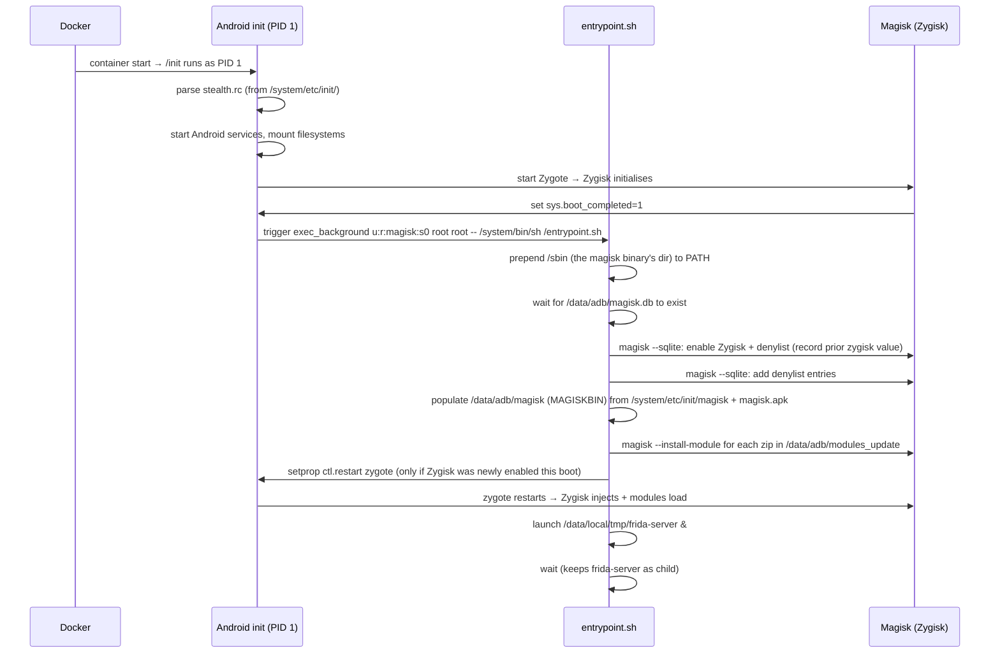

# Boot Flow

## The configuration chain (`beetroot.yaml` → helper sh)

Researcher-facing configuration lives in `beetroot.yaml` and flows
through pydantic models. The container-side helpers (`docker/*.sh`)
can't read YAML — Android's toybox sh has no YAML parser. Instead,
every container-side path is read from a `BEETROOT_*` env var with a
safe default, and the CLI plumbs the resolved values from the YAML
into the container's environment via the bundled compose template's
`environment:` block:

```
beetroot.yaml
  ↓ pydantic models (config.py — InstanceConfig, Magisk, Frida, ...)
  ↓ config.render_env()
instance .env file (per-instance, in the instance directory)
  ↓ docker compose --env-file <.env>  + the bundled compose template's
    `environment:` block (one ${KEY} per BEETROOT_* var)
container env vars (visible to PID 1 = Android `init`)
  ↓ Android init propagates env to services it spawns
helper shell scripts (entrypoint.sh / magisk-path.sh / magisk-config.sh / magisk-env.sh /
                      flash-modules.sh / activate-zygisk.sh / launch-frida.sh)
  reads `${BEETROOT_FRIDA_BIN:-/data/local/tmp/frida-server}` etc.
```

Everything is YAML-config-driven at the user-facing boundary; the
env-var layer exists strictly because toybox sh can't read YAML.
v0.3 had two breakages in this chain (the bundled compose template
hardcoded its mount targets, and `Stealth.denylist` was never plumbed
past pydantic); v0.4's T2 fixed both, so the chain is now
end-to-end. Adding a new helper-script env var means three coordinated
edits: declare the field on the matching pydantic model, emit the
`KEY=value` line from `render_env`, and add `${KEY}` substitution to
the bundled compose template (the helper's `${KEY:-default}` fallback
keeps the script runnable under a bare `docker run` without a
Beetroot-rendered `.env`).

## There is no Docker ENTRYPOINT

The Beetroot image has no `ENTRYPOINT` and no `CMD`. The container starts with redroid's default boot process, where `/init` runs as PID 1 — exactly as it does on a real Android device.

This is intentional. redroid's `/init` is Android's init process, and it needs to be PID 1 to drive the Android boot sequence (mounting virtual filesystems, starting services, launching Zygote, etc.). Replacing it with a Docker entrypoint script would break the Android environment.

## How `entrypoint.sh` gets invoked

Since there's no Docker entrypoint, Beetroot uses Android's own init system to run its configuration script.

At build time, `docker/stealth.rc` is copied to `/system/etc/init/stealth.rc` inside the image. Android's init parses all `.rc` files in `/system/etc/init/` at startup. `stealth.rc` registers a one-shot service that fires when `sys.boot_completed=1` — the property Android sets when the boot sequence is done.

The service runs as:

```
exec_background u:r:magisk:s0 root root -- /system/bin/sh /entrypoint.sh
```

The `u:r:magisk:s0` SELinux context gives the script the same permissions as Magisk itself, which is what it needs to call `magisk --sqlite` and `magisk --install-module`.

## Boot sequence



## `entrypoint.sh` step by step

Each numbered step below lives in a dedicated helper (see [Boot Scripts](boot-scripts.md) for per-helper contracts). The entrypoint itself is a few lines of glue that sources the helpers in order.

1. **Make `magisk` resolvable.** (`magisk-path.sh`.) `entrypoint.sh` is launched by Android init (`stealth.rc`'s `exec_background`), which inherits init's default service PATH — `/system/bin:/system/xbin:/vendor/bin:/product/bin:…` — and that does **not** include the directory Magisk installs its `magisk` binary into (`/sbin/magisk` on the redroid Magisk image). Every later helper calls bare `magisk`, so this runs **first** and prepends the first directory (from `BEETROOT_MAGISK_DIRS`, default `/sbin:/debug_ramdisk`) that actually holds an executable `magisk`. Without it, the daemon wait below would fail every probe and time out, aborting the whole boot before anything is configured. It's a no-op when `magisk` already resolves.

2. **Wait for the Magisk daemon.** (`magisk-config.sh`.) Polls `magisk --sqlite "SELECT 1"` in a bounded loop (default 120 one-second attempts, ~2 minutes — conservative because a first boot of redroid+Magisk can legitimately take a while). The DB at `/data/adb/magisk.db` is created by Magisk during its own initialization, which happens during the Zygote start. Without this wait, the SQL writes below would silently no-op. If Magisk never answers (broken or missing), the helper exits 1 and the boot configuration aborts loudly — the error surfaces in `docker compose logs` instead of the container hanging half-configured forever.

3. **Configure Magisk via SQL.** (`magisk-config.sh`.) Calls `magisk --sqlite` to enable Zygisk and the denylist, then inserts each package from `magisk.denylist` as a denylist entry. It also records the *prior* `zygisk` value before the write so step 6 knows whether this boot is the one that flips Zygisk on. The denylist write takes effect the next time Zygisk reads the DB.

4. **Populate the Magisk binary directory.** (`magisk-env.sh`.) The redroid-script image leaves `/data/adb/magisk` (MAGISKBIN) empty — on a real phone the Magisk *app* finishes the install the first time it's opened, copying the binaries and extracting the per-install scripts (`util_functions.sh`, `module_installer.sh`, …) out of `magisk.apk`. Headless redroid never runs that, so `magisk --install-module` would abort with "Incomplete Magisk install". This helper replicates the app's environment-fix headlessly: it copies the Magisk binaries from `/system/etc/init/magisk` and `busybox unzip`s the asset scripts out of `magisk.apk` into MAGISKBIN. It runs **before** the flash step for that reason, and is idempotent (it skips when `util_functions.sh` is already present).

5. **Flash modules.** (`flash-modules.sh`.) Iterates every `*.zip` in `/data/adb/modules_update` (the bind-mounted `<instance-dir>/modules/` directory — v0.4 T4 moved the target from the Beetroot-invented `/flash_dir` to Magisk's well-known staging dir) and calls `magisk --install-module <zip>`. Modules that are already installed are reinstalled safely (Magisk handles idempotency). A module that fails to install is logged with a `[!]` warning and skipped — boot continues.

6. **Activate Zygisk.** (`activate-zygisk.sh`.) Zygisk only injects zygote at zygote start, but step 3 enables it after `boot_completed` — when the first zygote has already started without it. So on the first boot of a fresh instance (where step 2 recorded a `0`/missing prior value) this helper restarts zygote once via `setprop ctl.restart zygote`, making Zygisk — and any Zygisk module just flashed (e.g. LSPosed) — active without the user having to `beetroot restart`. On later boots `zygisk` is already `1`, so magiskd injects the first zygote and no restart fires. Opt out with `BEETROOT_ZYGOTE_RESTART=0`.

7. **Launch Frida (if opted in).** (`launch-frida.sh`.) If `/data/local/tmp/frida-server` is executable, starts it in the background with `&`. When the instance's `beetroot.yaml` omits the `frida:` block (v0.3+ default), this path is a 0-byte non-executable placeholder and the launch is skipped — no Frida process inside the container.

8. **`wait`.** (Back in `entrypoint.sh`.) The script blocks on `wait` so the shell process stays alive. If Frida was launched, this also keeps it attached to the Docker container's process tree and means `docker compose logs` streams Frida's stderr alongside the entrypoint output.

## Shell environment

`entrypoint.sh` runs with `/system/bin/sh` — Android's toybox-derived shell. This is not bash or dash. It supports basic POSIX sh features but not bashisms like `[[ ]]`, arrays, or `<(process substitution)`. The script is written for toybox compatibility — do not introduce bash-specific syntax if you modify it.

## Helper scripts

`entrypoint.sh` is slimmed-down glue that sources six helpers in order — `magisk-path.sh`, `magisk-config.sh`, `magisk-env.sh`, `flash-modules.sh`, `activate-zygisk.sh`, `launch-frida.sh`. Each helper reads its container-side paths from a `BEETROOT_*` env var with a safe default, so v0.4's [stealth-posture path randomization](../design/stealth-posture.md) can swap paths per-build without touching helper code.

For the per-helper contracts (env vars, idempotency, exit semantics) and the modify-helpers checklist, see [Boot Scripts](boot-scripts.md).
