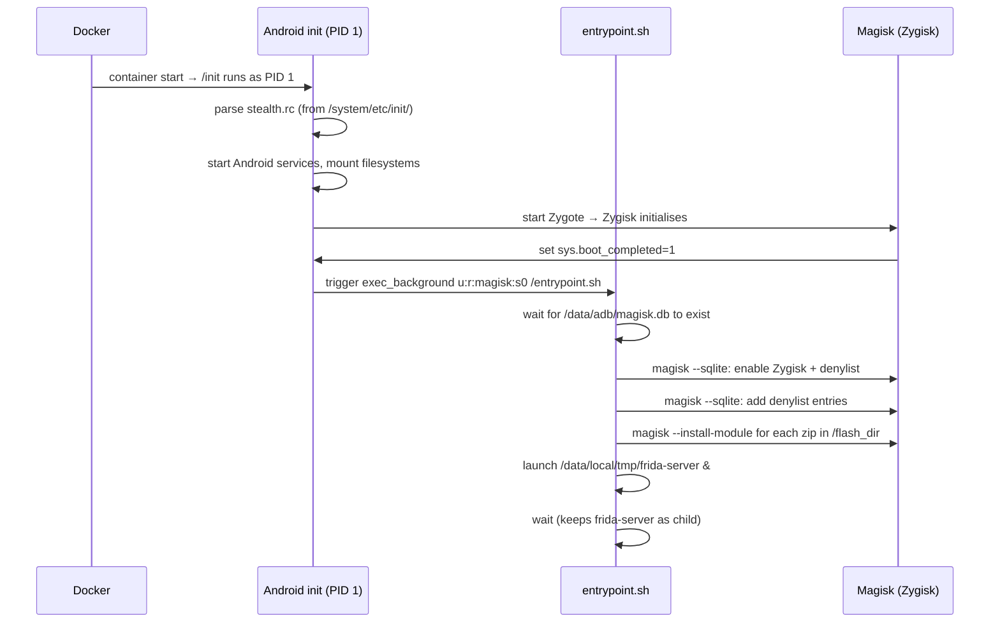

# Boot Flow

## There is no Docker ENTRYPOINT

The Beetroot image has no `ENTRYPOINT` and no `CMD`. The container starts with redroid's default boot process, where `/init` runs as PID 1 — exactly as it does on a real Android device.

This is intentional. redroid's `/init` is Android's init process, and it needs to be PID 1 to drive the Android boot sequence (mounting virtual filesystems, starting services, launching Zygote, etc.). Replacing it with a Docker entrypoint script would break the Android environment.

## How `entrypoint.sh` gets invoked

Since there's no Docker entrypoint, Beetroot uses Android's own init system to run its configuration script.

At build time, `docker/stealth.rc` is copied to `/system/etc/init/stealth.rc` inside the image. Android's init parses all `.rc` files in `/system/etc/init/` at startup. `stealth.rc` registers a one-shot service that fires when `sys.boot_completed=1` — the property Android sets when the boot sequence is done.

The service runs as:

```
exec_background u:r:magisk:s0 -- /system/bin/sh /entrypoint.sh
```

The `u:r:magisk:s0` SELinux context gives the script the same permissions as Magisk itself, which is what it needs to call `magisk --sqlite` and `magisk --install-module`.

## Boot sequence



## `entrypoint.sh` step by step

In v0.3, each numbered step below lives in a dedicated helper (see [Boot Scripts](boot-scripts.md) for per-helper contracts). The entrypoint itself is 12 lines of glue that sources the three helpers in order.

1. **Wait for the Magisk daemon.** (`magisk-config.sh`.) Polls `magisk --sqlite "SELECT 1"` in a loop. The DB at `/data/adb/magisk.db` is created by Magisk during its own initialization, which happens during the Zygote start. Without this wait, the SQL writes below would silently no-op.

2. **Configure Magisk via SQL.** (`magisk-config.sh`.) Calls `magisk --sqlite` to enable Zygisk and the denylist, then inserts each package from `stealth.denylist` as a denylist entry. These writes take effect the next time Zygisk reads the DB — which happens before any app process starts, because Zygisk hooks into Zygote before forking app processes.

3. **Flash modules.** (`flash-modules.sh`.) Iterates every `*.zip` in `/flash_dir` (the bind-mounted `<instance-dir>/modules/` directory) and calls `magisk --install-module <zip>`. Modules that are already installed are reinstalled safely (Magisk handles idempotency).

4. **Launch Frida.** (`launch-frida.sh`.) If `/data/local/tmp/frida-server` is executable, starts it in the background with `&`.

5. **`wait`.** (Back in `entrypoint.sh`.) The script blocks on `wait` so the shell process stays alive as the parent of the Frida server. This keeps the Frida process attached to the Docker container's process tree and means `docker compose logs` streams Frida's stderr alongside the entrypoint output.

## Shell environment

`entrypoint.sh` runs with `/system/bin/sh` — Android's toybox-derived shell. This is not bash or dash. It supports basic POSIX sh features but not bashisms like `[[ ]]`, arrays, or `<(process substitution)`. The script is written for toybox compatibility — do not introduce bash-specific syntax if you modify it.

## Helper scripts

In v0.3, `entrypoint.sh` was split into three helpers — `magisk-config.sh`, `flash-modules.sh`, `launch-frida.sh` — that the slimmed-down glue sources in order. Each helper reads its container-side paths from a `BEETROOT_*` env var with a safe default, so v0.4's [stealth-posture path randomization](../design/stealth-posture.md) can swap paths per-build without touching helper code.

For the per-helper contracts (env vars, idempotency, exit semantics) and the modify-helpers checklist, see [Boot Scripts](boot-scripts.md).
